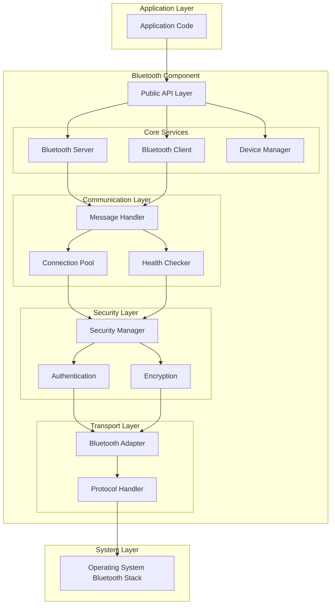

# 蓝牙通信组件设计文档

## 概述

本设计文档描述了一个完整的 Go 蓝牙通信组件的架构和实现方案。该组件利用 Go 1.25 的最新特性，提供高性能、类型安全的蓝牙通信解决方案。组件采用模块化设计，支持客户端/服务端模式，具备完善的连接管理、健康检查和安全功能。

## 架构

### 整体架构



### 分层设计

1. **应用层**: 用户代码接口
2. **API 层**: 公共接口和类型定义
3. **核心服务层**: 服务端、客户端、设备管理
4. **通信层**: 消息处理、连接池、健康检查
5. **安全层**: 安全管理、认证、加密
6. **传输层**: 蓝牙适配器、协议处理
7. **系统层**: 操作系统蓝牙栈

## 组件和接口

### 核心接口定义

```go
// 利用Go 1.25泛型特性的类型安全接口
type BluetoothComponent[T any] interface {
    Start(ctx context.Context) error
    Stop(ctx context.Context) error
    Send(ctx context.Context, deviceID string, data T) error
    Receive(ctx context.Context) <-chan Message[T]
    GetStatus() ComponentStatus
}

type BluetoothServer[T any] interface {
    BluetoothComponent[T]
    Listen(serviceUUID string) error
    AcceptConnections() <-chan Connection
    SetConnectionHandler(handler ConnectionHandler[T])
}

type BluetoothClient[T any] interface {
    BluetoothComponent[T]
    Scan(ctx context.Context, timeout time.Duration) ([]Device, error)
    Connect(ctx context.Context, deviceID string) (Connection, error)
    Disconnect(deviceID string) error
}
```

### 设备管理器

```go
type DeviceManager interface {
    DiscoverDevices(ctx context.Context, filter DeviceFilter) <-chan Device
    GetDevice(deviceID string) (Device, error)
    GetConnectedDevices() []Device
    RegisterDeviceCallback(callback DeviceCallback)
}

type Device struct {
    ID           string
    Name         string
    Address      string
    ServiceUUIDs []string
    RSSI         int
    LastSeen     time.Time
    Capabilities DeviceCapabilities
}
```

### 连接池管理

```go
type ConnectionPool interface {
    AddConnection(conn Connection) error
    RemoveConnection(deviceID string) error
    GetConnection(deviceID string) (Connection, error)
    GetAllConnections() []Connection
    SetMaxConnections(max int)
    GetStats() PoolStats
}

type Connection interface {
    ID() string
    DeviceID() string
    IsActive() bool
    Send(data []byte) error
    Receive() <-chan []byte
    Close() error
    GetMetrics() ConnectionMetrics
}
```

### 健康检查器

```go
type HealthChecker interface {
    StartMonitoring(ctx context.Context, interval time.Duration)
    StopMonitoring()
    CheckConnection(deviceID string) HealthStatus
    GetHealthReport() HealthReport
    RegisterHealthCallback(callback HealthCallback)
}

type HealthStatus struct {
    DeviceID      string
    IsHealthy     bool
    LastHeartbeat time.Time
    RSSI          int
    Latency       time.Duration
    ErrorCount    int
}
```

## 数据模型

### 消息模型

```go
// 利用Go 1.25泛型的类型安全消息
type Message[T any] struct {
    ID        string
    Type      MessageType
    Payload   T
    Metadata  MessageMetadata
    Timestamp time.Time
}

type MessageMetadata struct {
    SenderID    string
    ReceiverID  string
    Priority    Priority
    TTL         time.Duration
    Encrypted   bool
    Compressed  bool
}

type MessageQueue[T any] struct {
    messages chan Message[T]
    capacity int
    metrics  QueueMetrics
}
```

### 配置模型

```go
type BluetoothConfig struct {
    ServerConfig ServerConfig
    ClientConfig ClientConfig
    SecurityConfig SecurityConfig
    HealthConfig HealthConfig
}

type ServerConfig struct {
    ServiceUUID     string
    ServiceName     string
    MaxConnections  int
    AcceptTimeout   time.Duration
    RequireAuth     bool
}

type ClientConfig struct {
    ScanTimeout     time.Duration
    ConnectTimeout  time.Duration
    RetryAttempts   int
    RetryInterval   time.Duration
    AutoReconnect   bool
}
```

## 错误处理

### 错误类型定义

```go
// 利用Go 1.25改进的错误处理
type BluetoothError struct {
    Code      ErrorCode
    Message   string
    DeviceID  string
    Timestamp time.Time
    Cause     error
}

type ErrorCode int

const (
    ErrDeviceNotFound ErrorCode = iota
    ErrConnectionFailed
    ErrAuthenticationFailed
    ErrEncryptionFailed
    ErrMessageTimeout
    ErrInvalidData
    ErrResourceExhausted
)

func (e *BluetoothError) Error() string {
    return fmt.Sprintf("bluetooth error [%d]: %s (device: %s)",
        e.Code, e.Message, e.DeviceID)
}

func (e *BluetoothError) Unwrap() error {
    return e.Cause
}
```

### 错误恢复策略

1. **连接错误**: 自动重试机制，指数退避
2. **认证错误**: 重新配对，清除缓存凭据
3. **数据传输错误**: 消息重传，连接质量检查
4. **资源耗尽**: 连接清理，优先级管理

## 测试策略

### 单元测试

1. **接口测试**: 验证所有公共接口的正确性
2. **消息处理测试**: 测试消息序列化、反序列化
3. **连接管理测试**: 测试连接池的各种操作
4. **健康检查测试**: 验证健康监控逻辑
5. **安全功能测试**: 测试加密、认证机制

### 集成测试

1. **端到端通信测试**: 客户端与服务端完整通信流程
2. **多设备连接测试**: 测试多个设备同时连接
3. **故障恢复测试**: 测试各种故障场景的恢复能力
4. **性能测试**: 测试高并发和大数据量传输

### 模拟测试

```go
type MockBluetoothAdapter struct {
    devices     map[string]*MockDevice
    connections map[string]*MockConnection
    events      chan AdapterEvent
}

func (m *MockBluetoothAdapter) Scan(ctx context.Context) <-chan Device {
    // 模拟设备扫描
}

func (m *MockBluetoothAdapter) Connect(deviceID string) (Connection, error) {
    // 模拟连接建立
}
```

## 性能优化

### Go 1.25 特性利用

1. **泛型优化**: 使用泛型减少类型断言和反射开销
2. **并发改进**: 利用新的并发原语优化 goroutine 管理
3. **内存管理**: 使用新的内存分配器减少 GC 压力
4. **编译器优化**: 利用新的编译器优化提升性能

### 缓存策略

1. **设备缓存**: 缓存已发现的设备信息
2. **连接缓存**: 复用活跃连接
3. **消息缓存**: 缓存频繁发送的消息模板

### 并发设计

```go
// 利用Go 1.25的并发改进
type ConcurrentMessageHandler[T any] struct {
    workers    int
    workQueue  chan Message[T]
    resultChan chan ProcessResult[T]
    wg         sync.WaitGroup
}

func (h *ConcurrentMessageHandler[T]) ProcessMessages(ctx context.Context) {
    for i := 0; i < h.workers; i++ {
        h.wg.Add(1)
        go h.worker(ctx)
    }
}
```

## 安全设计

### 认证机制

1. **设备配对**: 支持 PIN 码和数字比较配对
2. **证书认证**: 支持 X.509 证书链验证
3. **令牌认证**: 支持 JWT 令牌认证

### 加密方案

1. **传输加密**: AES-256-GCM 加密数据传输
2. **密钥管理**: 安全的密钥生成、交换和存储
3. **完整性保护**: HMAC 消息认证码

### 访问控制

```go
type SecurityManager interface {
    Authenticate(deviceID string, credentials Credentials) error
    Authorize(deviceID string, operation Operation) error
    Encrypt(data []byte, deviceID string) ([]byte, error)
    Decrypt(data []byte, deviceID string) ([]byte, error)
    GenerateSessionKey(deviceID string) ([]byte, error)
}

type AccessPolicy struct {
    DeviceWhitelist []string
    AllowedOperations []Operation
    RequireEncryption bool
    SessionTimeout time.Duration
}
```

## 部署和配置

### 配置管理

```go
type ComponentBuilder struct {
    config BluetoothConfig
}

func NewBluetoothComponent() *ComponentBuilder {
    return &ComponentBuilder{
        config: DefaultConfig(),
    }
}

func (b *ComponentBuilder) WithServerConfig(config ServerConfig) *ComponentBuilder {
    b.config.ServerConfig = config
    return b
}

func (b *ComponentBuilder) Build() (BluetoothComponent[any], error) {
    // 构建组件实例
}
```

### 监控和日志

1. **结构化日志**: 使用 slog 进行结构化日志记录
2. **指标收集**: 收集连接数、消息量、错误率等指标
3. **健康检查端点**: 提供 HTTP 健康检查接口
4. **分布式追踪**: 支持 OpenTelemetry 追踪

这个设计充分利用了 Go 1.25 的新特性，提供了完整的蓝牙通信解决方案，具备良好的可扩展性、安全性和性能。
